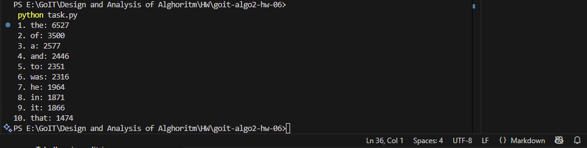
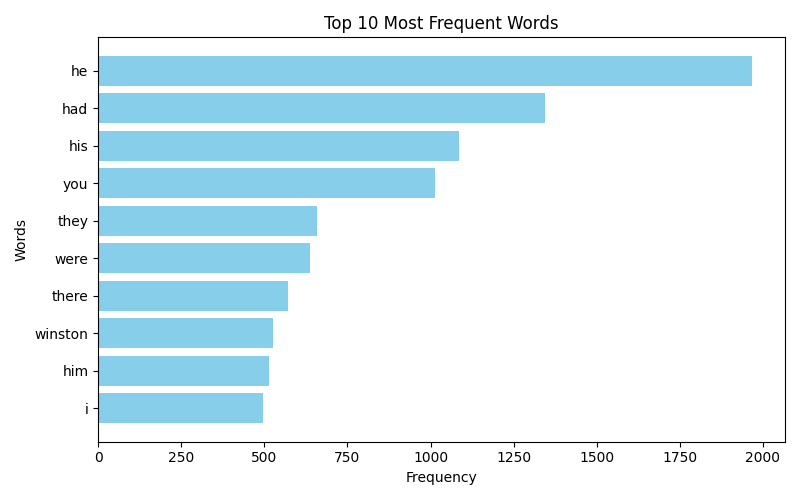

# Домашнє завдання до теми  MapReduce для підрахунку частоти слів + візуалізація

Цей проєкт реалізує підрахунок частоти слів у тексті за допомогою моделі **MapReduce** та багатопотоковості в Python.  
Вхідні дані можуть бути завантажені з **URL**.  
Результат виводиться в консоль та візуалізується у вигляді графіка.

---

##  Функціонал
- Завантаження тексту з інтернету або локального файлу
- Токенізація тексту та нормалізація (переведення у нижній регістр)
- Паралельна обробка за допомогою `ThreadPoolExecutor`
- Підрахунок частоти використання кожного слова
- Вивід топ-N найбільш вживаних слів
- Візуалізація результату за допомогою `matplotlib`

##  Запуск
1. Клонуйте репозиторій git clone https://github.com/nata87/goit-algo2-hw-06
2. У терміналі виконайте:

```bash
python task.py
```

---

Переконайтесь, що встановлено Python 3.10+ та, за потреби, бібліотеки

pip install -r requirements.txt

## Результат 





